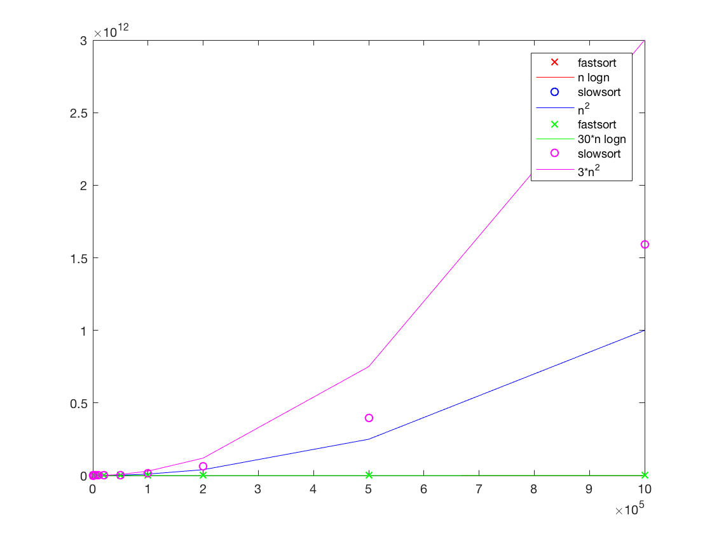
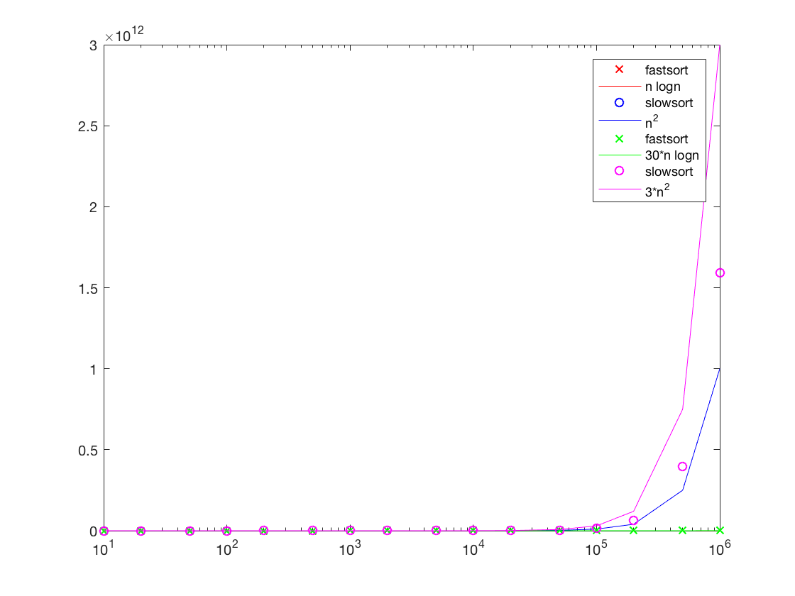
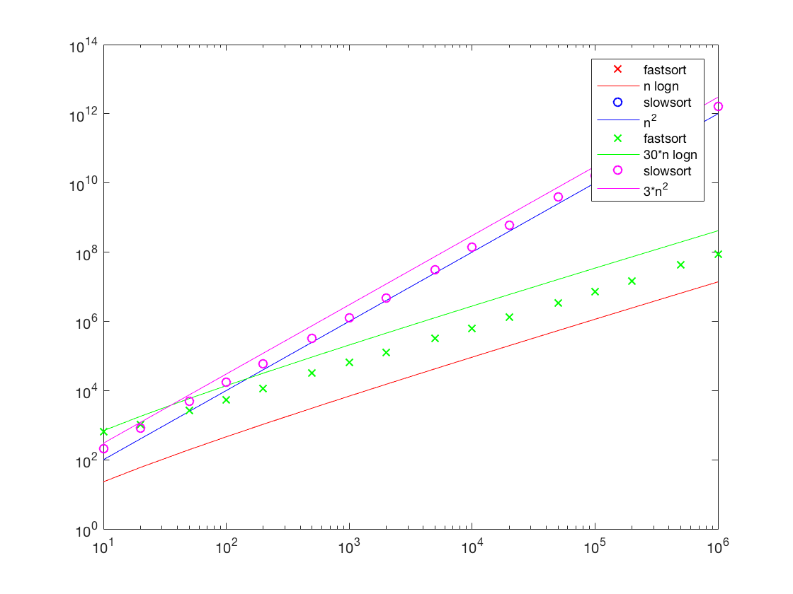

###*Farzad Vafaeinezhad, Sam Dindyal*
--
#Advanced Algorithms(CPS616) Assignment

 

*Which O(n2) are you implementing in this assignment?*

<input type="checkbox" disabled checked> <b>Bubble Sort</b> 
<input type="checkbox" disabled> Insertion Sort 
<input type="checkbox" disabled> Selection Sort 
<input type="checkbox" disabled> Other<input placeholder="Other" disabled></input>

 
*Which O(nlogn) algorithm are you implementing in this assignment?*

<input type="checkbox" disabled checked> <b>Merge Sort</b> 
<input type="checkbox" disabled> Quick Sort 
<input type="checkbox" disabled> Heap Sort 
<input type="checkbox" disabled> Other<input placeholder="Other" disabled></input>

 

***Why are you being asked to graph your values using a logarithmic x-axis?*** 

Graphing the values with a logarithmic x-axis provides for a better view of both functions, especially pertaining to the values of the nlogn function. Just like the nlogn function, its values are sparse in terms of their x values which makes a logarithmic x-axis perfect for displaying as many values as possible. In contrast to using the <code>plot</code> function, the <code>loglog</code> function horizontally compresses the graph.

 
####<code>plot</code> Graph

 

***Why are you being asked to graph your values using a logarithmic y-axis?*** 

Similar to the previous question however more so pertaining to the values of the n2 function. By using the <code>semilogx</code> function to graph both functions, we can see that, although all of the x values are visible at a reasonable scale, they just appear as a flat line and vertically compressed. The values do not form a very visible form of any sort and it's hard to differentiate between the two functions at times. Graphing both functions on a logarithmic y-axis allows the values to be more distinguishable in terms of their y values.

 
####<code>semilogx</code> Graph

 

***For which values of n does it make more sense to use <code>slowsort</code> instead of <code>fastsort</code>?*** 

*f(n) = 30nlog(n)* 
*g(n) = 3n2* 

*f(n) = g(n)* 
*n* &cong; 35

Therefore, for all values of n &le; 35, it is better to use slow sort. The data we collected also coincides with this.
<table>
<tr>
	<th colspan="3">Average Time (ns)</th>
</tr>
<tr>
	<th>N</th>
	<th><code>slowsort</code></th>
	<th><code>fastsort</code></th>
</tr>

<tr>
<td align="center">10</td>
<td align="center">211</td>
<td align="center">641</td>
</tr>
<tr>
<td align="center">20</td>
<td align="center">832</td>
<td align="center"> 1,046 </td>
</tr>
<tr>
<td align="center">50</td>
<td align="center"> 4,811 </td>
<td align="center"> 2,590 </td>
</tr>
<tr>
<td align="center">100</td>
<td align="center"> 17,127 </td>
<td align="center"> 5,448 </td>
</tr>
<tr>
<td align="center">200</td>
<td align="center"> 59,484 </td>
<td align="center"> 11,512 </td>
</tr>
<tr>
<td align="center">500</td>
<td align="center"> 329,049 </td>
<td align="center"> 31,683 </td>
</tr>
<tr>
<td align="center"> 1,000 </td>
<td align="center"> 1,236,118 </td>
<td align="center"> 63,865 </td>
</tr>
<tr>
<td align="center"> 2,000 </td>
<td align="center"> 4,768,017 </td>
<td align="center"> 124,500 </td>
</tr>
<tr>
<td align="center"> 5,000 </td>
<td align="center"> 30,455,982 </td>
<td align="center"> 318,814 </td>
</tr>
<tr>
<td align="center"> 10,000 </td>
<td align="center"> 137,170,419 </td>
<td align="center"> 630,194 </td>
</tr>
<tr>
<td align="center"> 20,000 </td>
<td align="center"> 609,172,356 </td>
<td align="center"> 1,326,659 </td>
</tr>
<tr>
<td align="center"> 50,000 </td>
<td align="center"> 3,964,567,009 </td>
<td align="center"> 3,439,664 </td>
</tr>
<tr>
<td align="center"> 100,000 </td>
<td align="center"> 15,930,529,921 </td>
<td align="center"> 7,032,603 </td>
</tr>
<tr>
<td align="center"> 200,000 </td>
<td align="center"> 63,658,762,894 </td>
<td align="center"> 14,837,992 </td>
</tr>
<tr>
<td align="center"> 500,000 </td>
<td align="center"> 397,349,597,058 </td>
<td align="center"> 42,573,181 </td>
</tr>
<tr>
<td align="center"> 1,000,000 </td>
<td align="center"> 1,594,043,609,832 </td>
<td align="center"> 86,751,919 </td>
</tr>

<table>

 

***<code>slowsort</code> &isin; O(n2) and <code>fastsort</code> &isin; O(nlogn) This means that there are two coefficients S and F such that for all values of n large enough <code>slowsort(n)</code> &le; Sn2 and <code>fastsort(n)</code> &le; Fnlogn. When you manipulated your graphs, what small values of S and F did you find which met this criteria?*** 

We found the following values for our coefficients:  

*S = 3* 
*F = 30*

 
####<code>loglog</code> Graph

 

**Do you have any comments about the behaviours of your slowsort and fastsort?**

Moving forward with these algorithms, an efficient solution would be to implement a function or method which chooses the appropriate algorithm based on the input size.

